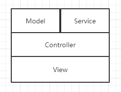

# 架构

## 架构相关
### 分层架构

- service，业务层。封装到Service里的逻辑有：
    - 牵涉到外部行为，如发送Email，使用外部API.
    - 使用PHP写的逻辑，如根据购买的件数有不同的折扣，如果写在Controller里面，会造成代码臃肿.
    - 也可以分担控制器层，避免控制器层代码冗长.

- 备注：分层对代码规范很重要，决定以后的代码是否能够复用、是否职责清晰、边界清晰.

## 软件框架模式
### SOA架构(Service Oriented Architecture)
